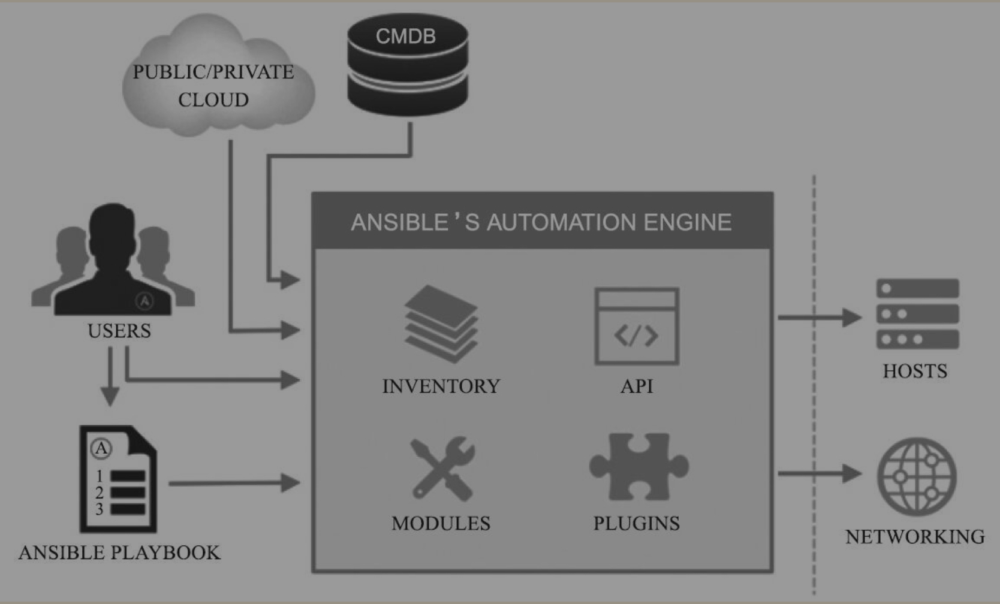

## 1.Ansible是什么？能帮助我们做什么？

### 1.1 定义

	官网定义：`Ansible is a radically simple IT automation engine`。即Ansible是一款极其简单的IT自动化工具。

### 1.2 作用
	帮助运维人员实现IT工作的自动化、降低认为操作失误、提高业务自动化率、提升运维工作效率，常用于软件部署自动化、配置自动化、管理自动化、系统化任务系统、持续集成、零宕机平滑升级等。它丰富的内置模块和开放的API接口，同时遵循GPL协议的企业或个人都可以随意修改和发布自己的版本。

#### 1.2.1 Ansible模块覆盖面

   	 1). 系统层：支持的系统有Linux、Windows、AIX等，对应的模块有acl、cron、pip、easy_install、yum、authorized_key等大量的内置模块

  	 2). 知名第三方平台支持：

#### 1.2.3 Ansible应用场景

  - 文件传输
  - 命令执行

---

## 2.Ansible架构

## 3. Ansible通讯发展史

## 4. Ansible的安装部署

## 5. Python多环境扩展管理

